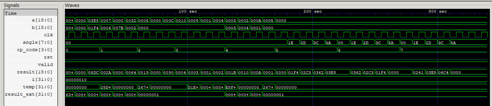
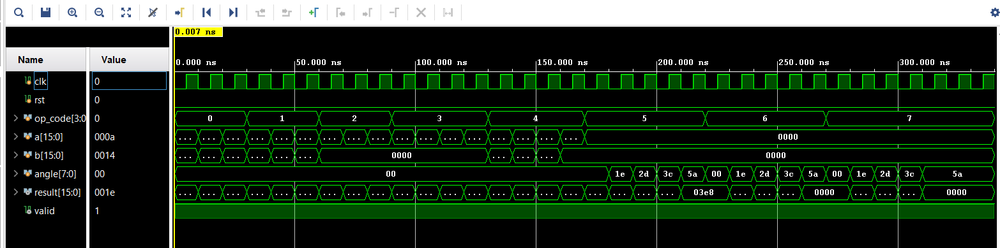

# Scientific Calculator on FPGA (Vivado, Verilog)

This repository contains the design, simulation, and schematic visualization of a **scientific calculator** fully described in Verilog and engineered for FPGA implementation. The project was constructed and validated using **Xilinx Vivado**, with additional simulation using Icarus Verilog and GTKWave.

---

## Table of Contents

- [Project Overview](#project-overview)
- [Features](#features)
- [Directory Structure](#directory-structure)
- [Module Architecture](#module-architecture)
- [Testbench](#testbench)
- [Vivado & Simulation Results](#vivado--simulation-results)
- [How to Run the Project](#how-to-run-the-project)
- [Screenshots](#screenshots)
- [License](#license)
- [Acknowledgements](#acknowledgements)

---

## Project Overview

This project implements a sophisticated scientific calculator on FPGA, using Verilog HDL. It supports both **basic arithmetic** and a range of **scientific functions** (power, square, square root, trigonometric operations) through modular RTL, accompanied by a dedicated testbench. All development and waves, RTL schematics, and technology mappings were performed and visualized in Vivado, Icarus Verilog, and GTKWave.

---

## Features

- **Arithmetic:** Addition, Subtraction, Multiplication, Division
- **Scientific:** Power ($a^b$), Square, Square Root, Sine, Cosine, Tangent (with LUT-based fixed-point output)
- **Combinational ALU** for bitwise operations (AND, OR, XOR, NOT)
- **Testbench Driven:** Systematic verification for all supported operations
- **Schematic Views:** RTL & technology schematics from Vivado
- **Simulation Outputs:** Command-line and waveform visuals

---

## Directory Structure

```
scientific_calculator/
│
├── Images/
│   ├── Gtkwave_output.png
│   ├── Iverilog_Output.png
│   ├── RTL Schematic.png
│   ├── Technology Scematic.png
│   └── Vivado_output.png
├── calc.v           # All functional modules
├── testbench.v      # Automated testbench
├── LICENSE.md
└── README.md
```

---

## Module Architecture

All logic is in `calc.v`.  
Top-level module: `sc` (scientific calculator controller).

- **sc**: Connects all computation modules and selects output based on `op_code`.
- **alu**: Arithmetic/bitwise logic (add, mul, sub, div, and, or, xor, not).
- **square, sqrt**: Integer square and square root (for demo/perfect squares).
- **power**: Modular exponentiation.
- **trig_lut, trig_lut_cos, trig_lut_tan**: Simple fixed-point Look-Up Tables for trigonometric functions, mapping selected angles to scaled integer values for sine, cosine, tangent.

#### Operation Select (`op_code`)
| op_code | Operation         | Details                                 |
|---------|-------------------|-----------------------------------------|
| 0000    | Addition          | a + b                                   |
| 0001    | Multiplication    | a * b                                   |
| 0010    | Square            | a × a                                   |
| 0011    | Square root       | sqrt(a), selected perfect squares       |
| 0100    | Power             | a ^ b                                   |
| 0101    | Sine              | angle, output scaled by 1000            |
| 0110    | Cosine            | angle, output scaled by 1000            |
| 0111    | Tangent           | angle, output scaled by 1000            |

---

## Testbench

The file `testbench.v` automates:

- Stimulus for each supported operation
- Multiple input combinations for functional coverage
- Writes VCD files (`wave.vcd`) for waveform inspection
- Console output matching every operation

Sample simulation outputs:
- **Console:**  
  ```
  Addition: 10 + 20 = 30
  Multiplication: 7 * 6 = 42
  ...
  Sine: sin(30 deg) = 500 (scale 1000)
  ```

- **Waveforms:**  
  View and analyze with GTKWave or Vivado (see screenshots below).

---

## Vivado & Simulation Results

- **Icarus Verilog Output:**  
  

- **GTKWave Output:**  
  

- **Vivado Output:**  
  

- **Vivado RTL Schematic:**  
  

- **Vivado Technology Schematic:**  
  

*Use these visuals to validate the design's simulated, RTL, and hardware-mapped structure.*

---

## How to Run the Project

### Prerequisites

- Xilinx Vivado (for synthesizing/implementing and schematic views)
- Icarus Verilog (`iverilog`), GTKWave (for open-source simulation/waveform)

### 1. Clone Repo
```sh
git clone https://github.com/230140111021tej/scientific_calculator.git
cd scientific_calculator
```

### 2. Simulate (Open-Source Flow)

```sh
iverilog -o sim_out testbench.v
vvp sim_out
gtkwave wave.vcd &
```

### 3. Simulate/Synthesize (Vivado)
- Add `calc.v` and `testbench.v` as source/simulation files
- Run behavioral simulation for waveform/console output
- Run synthesis, implementation for hardware mapping
- View **RTL Schematic** and **Technology Schematic** in the Vivado GUI

---

## Screenshots

See the [Images](./Images/) directory for all result graphics:

- Simulation results on both CLI and GTKWave
- Vivado output console
- RTL/Technology schematic captures

---

## License

Licensed under the MIT License—see [LICENSE.md](LICENSE.md).

---

## Acknowledgements

- Project: [230140111021tej](https://github.com/230140111021tej)
- Tools: Xilinx Vivado, Icarus Verilog, GTKWave

---

**Issues, questions, or improvements?**  
Feel free to open an issue or PR in this repo!
